# Deploy CloudBees Core on Azure
This documentation refers to deployment and post deployment instructions for running CloudBees Core on Azure Kubernetes Service in Azure Cloud. 

## Pre-Requisite
* Valid Azure Subscription
* SPN Details(Required Only if you're creating a new AKS Cluster as a part of CloudBees Core deployment): You need to supply Azure AD SPN App ID and Secret to be used with AKS Cluster See [documentation](https://docs.microsoft.com/en-us/azure/container-service/kubernetes/container-service-kubernetes-service-principal) on more information about how to create this. 

 
 
 ## How to Deploy

* Search for CloudBees Core in your Azure portal of follow this [marketplace page](https://azuremarketplace.microsoft.com/en-us/marketplace/apps/cloudbees.cloudbees-core-preview?tab=Overview). Click on **Get this Now** to start deployment

* This will launch Azure Portal, Login with your account and Click **Next**. 

* Select your **Azure Subscription**,  **Resource Group** and **Azure region** where you'd want to deploy CloudBees Core. Please note that **AKS** is not available in all regions, Be sure to check [this page](https://azure.microsoft.com/en-us/global-infrastructure/services/?products=kubernetes-service&regions=all) to validate if AKS is available in the region you selected.

* Choose if you're using an existing **AKS** Cluster or you want to deploy a new **AKS** Cluster
  ** If you're deploying a New AKS Cluster, You'll need to supply Cluster Name, AD SPN for AKS and DNS Prefix for AKS Cluster
  ** If you're deploying CloudBees Core on an existing AKS Cluster, you'll need to supply name of existing AKS Cluster and it's **resource group**.
  
* Click Purchase after reviewing all details. Deployment will take around 15 minutes when deploy on a new AKS Cluster, 3 to 4 minutes when using an existing AKS Cluster.

* Review Post deployment documentation on sucess. 


## Post Deployment Steps

* Verify that Azure deployment is sucessful. 

* Connect to AKS Cluster via Cloudshell or  ```az cli ```. See [this](https://docs.microsoft.com/en-us/azure/aks/kubernetes-walkthrough#connect-to-the-cluster) for more information abotu connecting to AKS Clusters. 
 ```
az aks get-credentials --resource-group myAKSCluster --name myAKSCluster
 ```

* Verify deployments by ensuring **cjoc-0** pod is running. If status is creating etc, you should wait around 2 minutes for completion and try this command again. 
 ```
kubectl get pods
 ```
 *   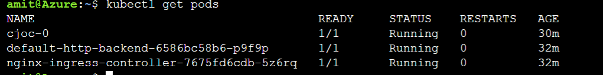
* Run following command to find admin password of jenkins instance. Please ensure to wait for **cjoc-0** container to get into running state. Copy the string output of this command, this is your password to unlock your CloudBees Core instance. 
 ```
kubectl exec cjoc-0 -- cat /var/jenkins_home/secrets/initialAdminPassword
 ```
  *   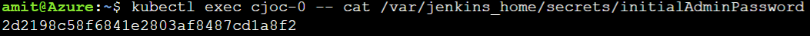
* CloudBees Core is published to interview via Ingress Controller. Let's find out the ingress details for CJOC web interface. This would be something like  ```cjoc.X.X.X.X.xip.io ```. Make a note of this URL. 

 ```
 kubectl get ingress
 ```
   *   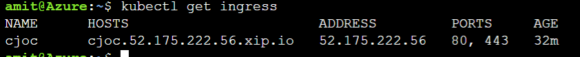
* Launch a Web Browser and browse to the CJOC URL copied from last step. This will open CJOC interface. Enter the Admin password copied from previous steps.

* CLick on Next and provide license details,  install required pluging and create users for admin interface. 

* On Sucessful completion, you can login to CJOC interface and start using CloudBees Core.  See CloudBees Core [official documentation](https://go.cloudbees.com/docs/cloudbees-core/cloud-intro/) for further configurations and information.


## CloudBees Core Setup

* Launch a Web Browser and browse to the CJOC URL copied from last step. This will open CJOC interface. Enter the Admin password copied from previous section.
  *   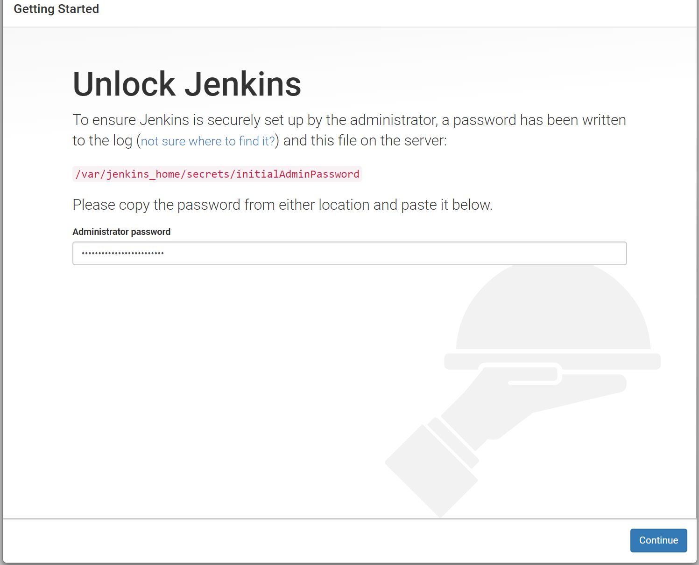

* Click on Next and provide license details, You can also choose to signup for a trial here. 

  *   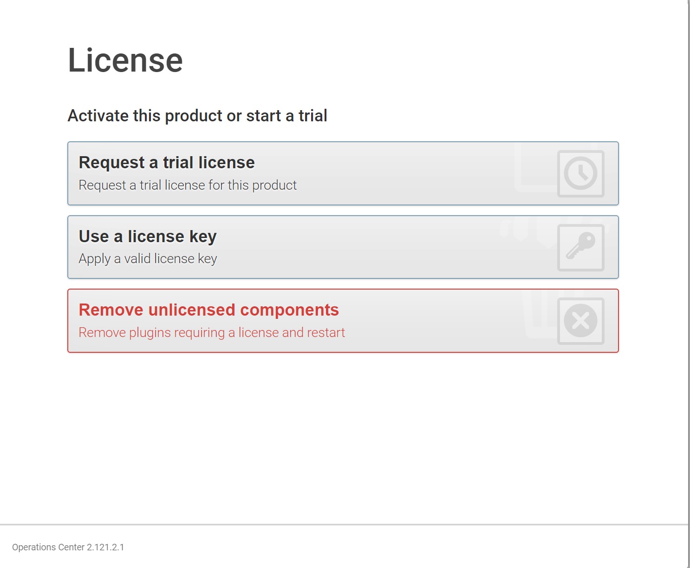
  
* Customize your Jenkins by installing all suggested plugings or select what all plugins you'd want to install. 

  *   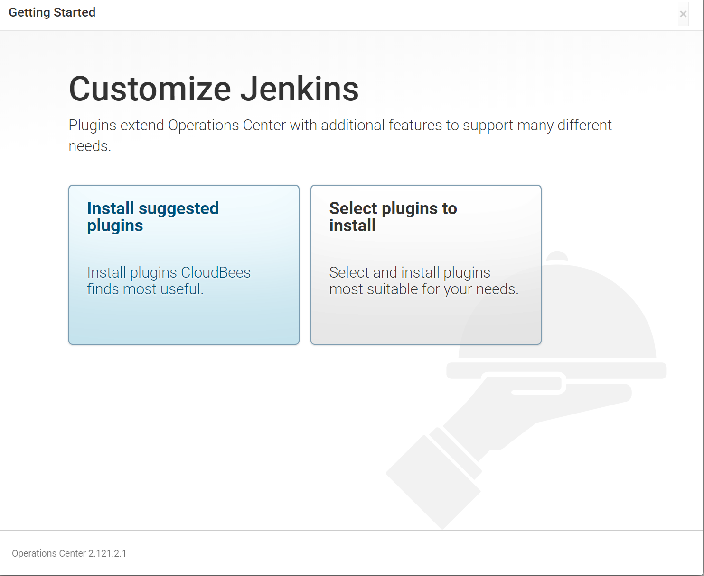

* Plugin installation should start now, Click Next on completion. 

  *   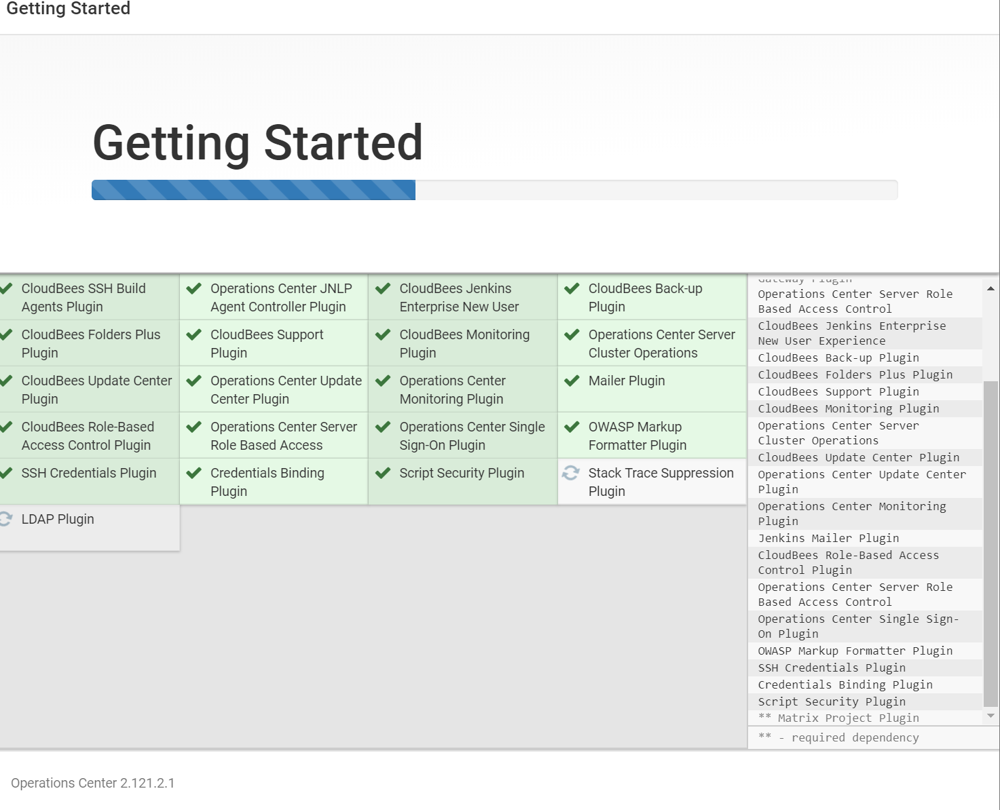
  
* Create an Admin User, This will be used to logint to **CJOC**.
  *   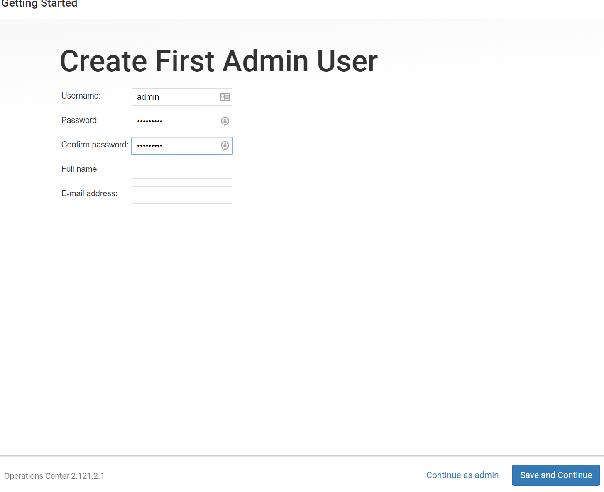
  
* Operations Center is now ready to use. Click on **Start Using Operations Center** to begin
  *   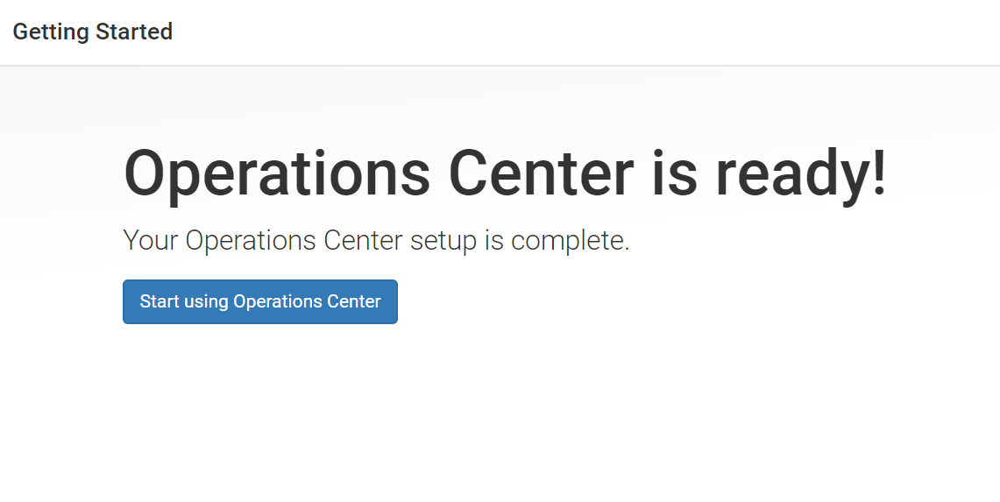
  
* CloudBees Core is now deployed sucessfully and is ready to use. See CloudBees Core [official documentation](https://go.cloudbees.com/docs/cloudbees-core/cloud-intro/) for further configurations and information.
  *   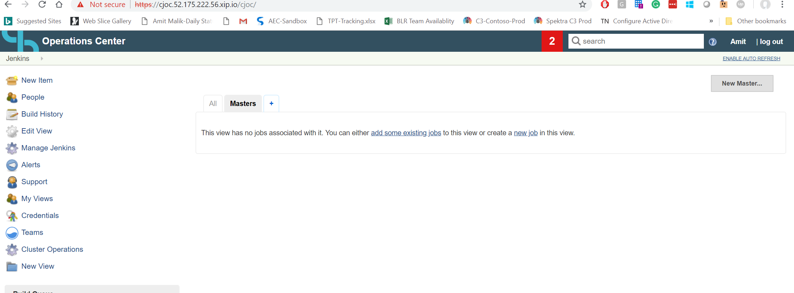


## Cleaning up 
This deployment uses [Azure Container Instances](https://azure.microsoft.com/en-us/pricing/details/container-instances/) as bootstrap deployment. You can delete the ACI instance created by deployment on sucessful completion. Although it doesn't cost anything since the ACI is in terminated state, it is advised to cleanup the ACI after sucessful completion of **Post Deployment Steps** given in this document.

ACI name would be **coreBootstrapContainerExistingAKS** if you're using existing AKS Cluster , **coreBootstrapContainerNewAKS** if you're creating a new AKS cluster as a part of deployment.


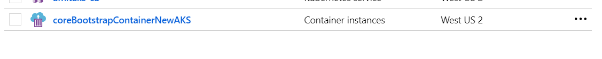

## Troubleshooting
Review following settings and configuration if your  deployment fails

* Review the error logs on ARM deployment page. Commonly deployment failures are due to subscription quota limits etc.
* In case of deployment failure with new AKS, Verify that supplied AAD SPN is correct. Review pre-requisite section for more details.
* Incase of deployment failure with existing AKS, verify the Cluster Name and Resource Group Name of cluster is correct and try re-deploying. You can delete the failed ACI containers before your re-deploy. 

Reach out to [support](mailto:support@spektrasystems.com) in case of any questions. 
